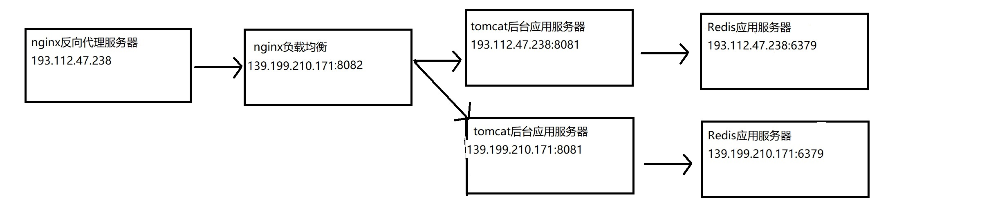

网站 ：http://blog.liuffei.cn

后台管理系统：http://blog.liuffei.cn/admin/admin-blog.html

update date : 2018-05-13

Author : liuffei

Project : blog

一：这个项目将会使用哪些技术？

(1)后台:maven+springboot+mybatis+redis+FastDFS

(2)前端:vue+axios+js+amazeui

(3)数据库:mysql

二：这个网站目前已经实现的功能有：

(1)利用开源框架gecco获取csdn,cnblogs,osc的首页数据。要点：遍历元素，jquery选择器

(2)用vue的组件封装了标题栏，减少了标题代码的重复率。

(3)登录注册功能。

(4)仿segmengfault的上传头像功能。

(5)使用amazeui重构页面，完成markdown编辑器的增删改查,存草稿待完成。(2018-04-03)

(6)完成后台登录验证(2018-04-09)

(7)引入spring-data-redis,修改接口的返回值是JSONObject(原来的ObjectMapper不支持Redis的序列化)(2018-04-12)

(8)自定义登录异常，添加页面处理登录异常的操作，整理代码，对外的博客网站和对内管理员使用的后台管理系统环境初步搭建完成(2018-04-15)。

(9)完成通过指定的UTRL下载文件，上传文件到指定的服务器还没有完成。(2018-04-23)

(10)用环绕通知和异常通知替代每个方法的try{}catch(){}。(2018-04-25)

(11)分布式文件系统FastDFS环境搭建完成。(2018-05-01)基于FastDFS Client API的上传下载功能完成。(2018-05-06)

测试图片:http://193.112.47.238:8090/group1/M00/00/00/rBAAEFroDnyANbpFAAMstKSbgtU845_big.jpg

参考资料:1.https://www.cnblogs.com/yufeng218/p/8111961.html        2.http://bbs.chinaunix.net/forum-240-1.html

(12)数据库连接池整合为HikariCP。原来是Tomcat Jdbc,SpringBoot 2.0默认的数据库连接池是HikariCP。(2018-05-07)

(13)统计博客的点击量：以(key=id,value=clickCount)的形式存储在map中，定时器每天凌晨3点同步点击次数到数据库。(2018-05-29)

(14)添加websocket对博客更新状态进行消息推送(2018-06-05)。

(15)添加gitment对评论进行管理(2018-06-06)。

(16)修改主页、目录列表和菜单列表的样式，实现nginx负载均衡(2018-07-17)，如下图：

(17)完善websocket的消息推送，当新增修改了博客信息时，推送通知到主页，同时将通知存储在数据库，第一次加载主页时，会发送数据库最新的通知到后台。(2018-07-30)

三：部署

特点：前后端分开部署

(1)前端：nginx作为反向代理服务器。

(2)后台：springboot使用内置的tomcat。

(3)运行在腾讯云centos7.3操作系统。

(4)部署命令：

nohup java -jar -Dspring.profiles.active=dev2 blog-1.0.0.jar > blog.log &
